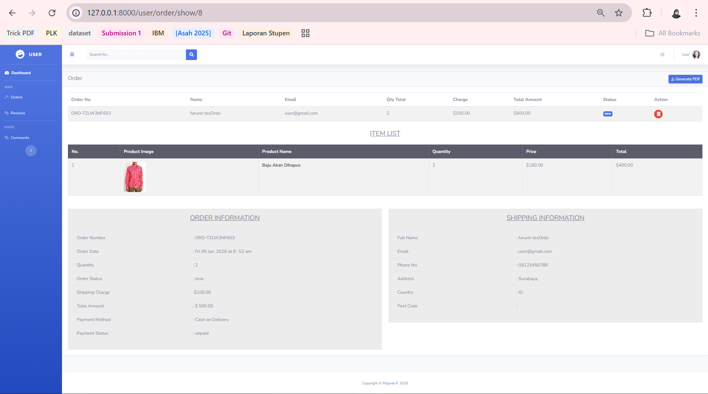
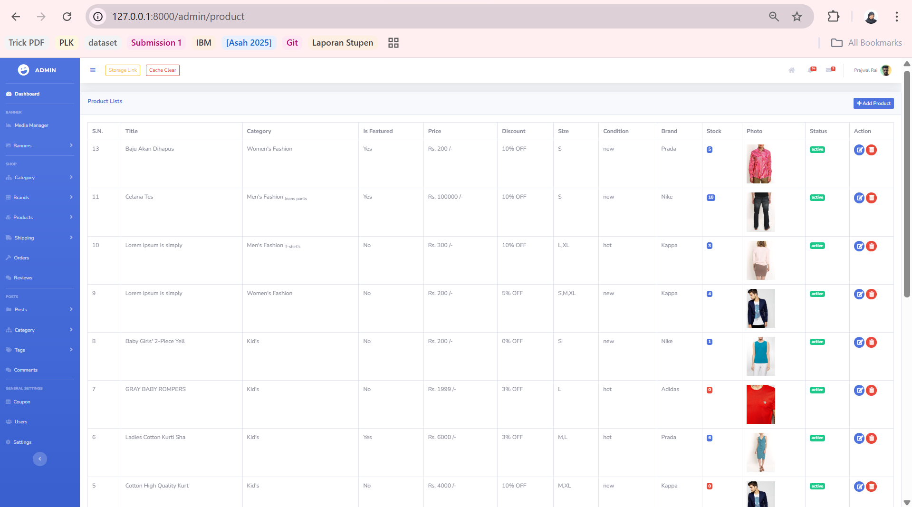
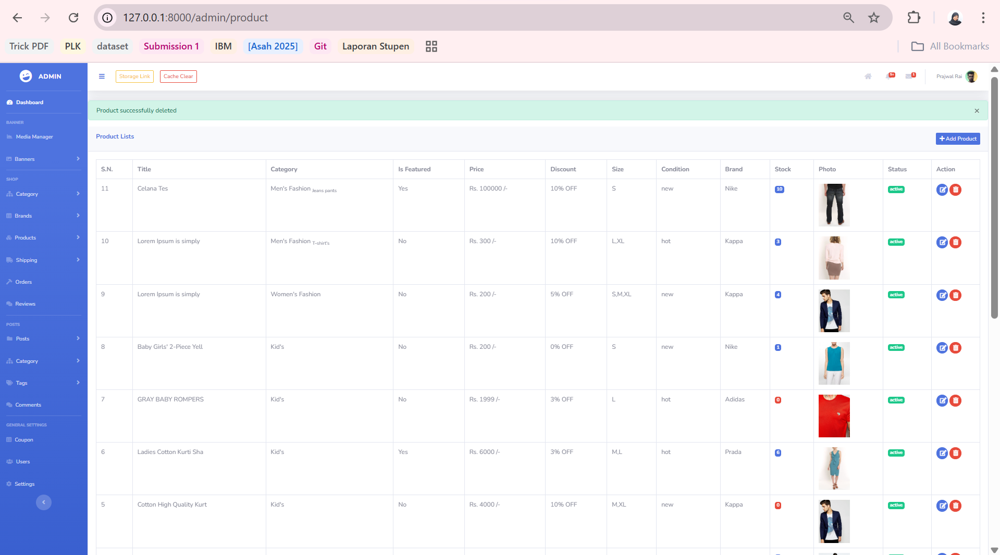
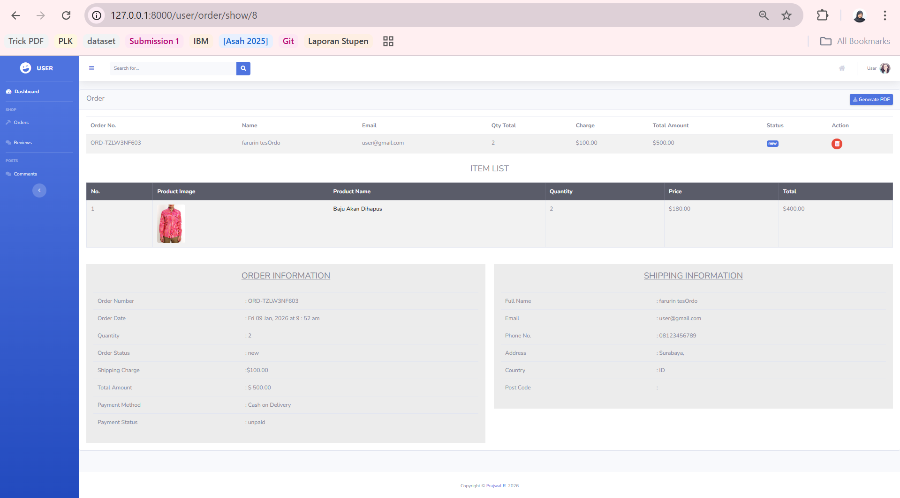
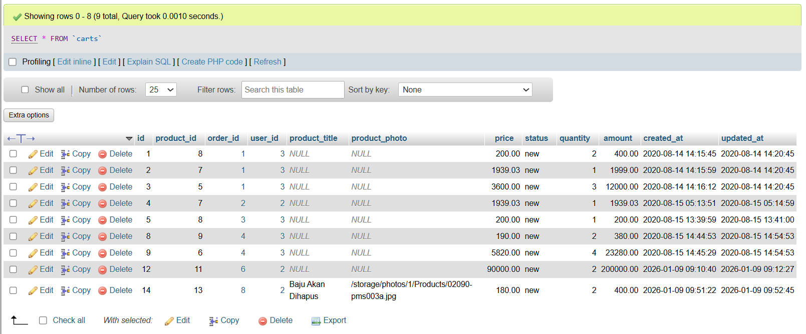

# Laporan Pengerjaan Take-Home Test Backend Test - Luthfiyana

Repository ini adalah hasil pengerjaan take-home test untuk posisi Backend Developer. Dokumen ini berisi informasi tugas, langkah implementasi, dan saran perbaikan project.

## 📋 Task & Deliverables

Berikut adalah instruksi tugas yang diberikan:

**Tasks:**

1.  **Order Detail:** Menampilkan daftar produk (Product List) pada halaman detail order user (`/user/order/show/{order_id}`).
2.  **Data Integrity:** Memastikan detail order tidak berubah/hilang jika Admin mengupdate atau menghapus produk master.
3.  **Suggestions:** Menambahkan bagian saran/improvement pada README.

**Deliverables:**

-   Code changes (commits dengan pesan yang jelas).
-   README berisi "Implementation notes".
-   Bukti screenshot (Before/After update & delete product).

---

## 🛠️ Implementation Notes

Berikut adalah solusi teknis yang saya terapkan untuk menyelesaikan tugas di atas:

### Task 1: Menampilkan Item di Order Detail

-   **Masalah:** User hanya melihat total harga tanpa rincian barang.
-   **Solusi:** Saya mengedit file view `resources/views/user/order/show.blade.php`. Menggunakan relasi `$order->cart` untuk meloop dan menampilkan tabel berisi Gambar, Nama Produk, Quantity, dan Harga Satuan.

### Task 2: Menangani Perubahan Data Produk (Snapshot)

-   **Masalah:** Saat produk diedit atau dihapus oleh Admin, data di history belanja user ikut berubah atau hilang (error) karena tabel `carts` hanya menyimpan `product_id`.
-   **Solusi:**
    1.  **Database Migration:** Menambahkan kolom `product_title` dan `product_photo` di tabel `carts` sebagai **snapshot**. Ini berfungsi menyimpan nama dan foto produk _pada saat transaksi terjadi_.
    2.  **Controller Logic:** Mengupdate `CartController` agar saat user menekan "Add to Cart", nama dan foto produk saat itu langsung disimpan ke tabel `carts`.
    3.  **Handling Delete:** Mengubah aturan database agar kolom `product_id` bersifat `nullable`. Jadi jika master produk dihapus, data di keranjang tidak ikut terhapus otomatis, dan view akan menampilkan data dari snapshot.

---

## 🚀 Suggestions / Improvements

Berdasarkan pengalaman mengerjakan tugas ini, berikut adalah beberapa saran sederhana:

### 1. Arsitektur Database (Pemisahan Tabel)

Saat ini history belanja dan keranjang sementara digabung di tabel `carts`.

-   **Saran:** Sebaiknya dipisah menjadi tabel `carts` (untuk keranjang aktif) dan `order_items` (untuk arsip transaksi). Dengan begitu, history belanja tidak akan rusak meskipun data produk asli diedit atau dihapus.

### 2. Validasi Input (Form Request)

Validasi input saat ini masih ditulis di dalam Controller.

-   **Saran:** Menggunakan fitur **Form Request** Laravel. Ini akan memisahkan logika pengecekan data (validasi) dari logika bisnis, sehingga Controller lebih bersih dan mudah dibaca.

### 3. Optimasi Query (N+1 Problem)

Di beberapa tampilan, sistem memanggil database berkali-kali di dalam looping (terutama saat mengambil data produk dari relasi cart).

-   **Saran:** Menggunakan teknik **Eager Loading** (dengan fungsi `with()`) saat mengambil data dari database. Ini akan mengurangi jumlah query dan mempercepat loading halaman.

---

## 📸 Screenshots & Proof of Work

Berikut adalah bukti implementasi dari tugas yang dikerjakan:

### 1. Order Detail Implementation (Task 1)

User sekarang bisa melihat daftar barang yang dibeli (sebelumnya hanya total harga).


### 2. Data Integrity / Snapshot Proof (Task 2)

Bukti bahwa detail order **tetap aman** meskipun Produk Master sudah dihapus oleh Admin.

**Phase 1: Kondisi Normal (Sebelum Penghapusan)**
Produk tersedia di Admin Panel dan tampil dengan normal di detail order User.



**Phase 2: Simulasi Penghapusan (Setelah Dihapus)**
Admin menghapus produk tersebut dari sistem. Terlihat produk sudah tidak ada di list Admin, namun **masih tetap tampil** di detail order User (menggunakan data snapshot).


_(Note: Data nama & foto diambil dari tabel `carts` yang sudah dimodifikasi, bukan lagi relasi ke tabel `products` yang sudah hilang)_

### 3. Database Structure Change

Penambahan kolom `product_title` dan `product_photo` pada tabel `carts` sebagai snapshot.


---

<br><br>
_(Original README content follows below)_

---

# Original README Content

[](https://github.com/Prajwal100)
[](https://github.com/Prajwal100/Complete-Ecommerce-in-laravel-10/stargazers)
[](https://github.com/Prajwal100/Complete-Ecommerce-in-laravel-10/network)
[](https://choosealicense.com/licenses/mit/)
[](https://buymeacoffee.com/prajwalrai/support-my-work-complete-laravel-e-commerce-project)

# 🚀 Complete E-commerce Website in Laravel 10

A full-fledged **eCommerce solution** built on **Laravel 10**, featuring a modern UI, powerful admin panel, seamless payment integration, and a user-friendly shopping experience.

---

## 🎥 Live Demo & Tutorials

🔹 **Setup Video:** [Watch Here](https://www.youtube.com/watch?v=URX5D1A5XQ4&t=19s)
🔹 **Demo Video:** [Live Demo](https://youtu.be/RxyrQQ3oTIE?si=Iq25IuJ8_eB5OJpC)
🔹 **Complete Tutorial Series:** [Watch Now](https://www.youtube.com/watch?v=FdAMucaks64&list=PLIFG3IUe1Zxo8Zvju3_kJJvoKSaIP_SC_&index=1&t=44s)

---

## 🌟 Features

### 🔹 **Frontend**

-   ⚡ **Progressive Web App (PWA) support**
-   🎨 **Modern & responsive design**
-   🛒 **Shopping cart, wishlist, and order tracking**
-   🔎 **SEO-friendly URLs & metadata**
-   💳 **Integrated PayPal payment gateway**
-   📢 **Social login (Google, Facebook, Github)**
-   💬 **Multi-level comments & reviews**

### 🔹 **Admin Dashboard**

-   🎛️ **Role management**
-   📊 **Advanced analytics & reporting**
-   🛍️ **Product & order management**
-   🔔 **Real-time notifications & messaging**
-   🏷️ **Coupon & discount system**
-   📰 **Blog & category management**
-   📸 **Media & banner manager**

### 🔹 **User Dashboard**

-   📦 **Order history & tracking**
-   💬 **Review & comment system**
-   🔧 **Profile customization**

---

## 🛠️ Installation Guide

### 🔹 **Step 1: Clone the Repository**

```sh
git clone https://github.com/Prajwal100/Complete-Ecommerce-in-laravel-10.git
cd Complete-Ecommerce-in-laravel-10
```

### 🔹 **Step 2: Install Dependencies**

```sh
composer install
npm install
```

### 🔹 **Step 3: Environment Setup**

```sh
cp .env.example .env
php artisan key:generate
```

Update `.env` with database credentials.

### 🔹 **Step 4: Database Configuration**

```sh
php artisan migrate --seed
```

Import `database/e-shop.sql` into your database manually (if needed).

### 🔹 **Step 5: Setup Storage**

```sh
php artisan storage:link
```

### 🔹 **Step 6: Run the Application**

```sh
php artisan serve
```

🔗 Open `http://localhost:8000`

### **Admin Login Credentials:**

📧 **Email:** `admin@gmail.com`  
🔑 **Password:** `1111`

---

## 🎙️ Transform Text into Speech with NepVox! 🔊

🚀 **[NepVox](https://nepvox.com/)** is an advanced **AI-powered text-to-speech** platform that helps you convert any text into natural human-like voice effortlessly.

✅ **Supports multiple languages & voices**
✅ **Perfect for videos, accessibility & podcasts**
✅ **Simple API integration for businesses**

🎧 **Experience it now:** [NepVox AI TTS](https://nepvox.com/)

---

## 📷 Screenshots

### **Admin Panel**


### **Product Management**


### **User Dashboard**


---

## 📩 Contact Me

💼 Need a **Full Stack Laravel Developer**? Let's work together!

📧 **Email:** Prajwal.iar@gmail.com  
📲 **WhatsApp:** +977-9818441226

🔗 **[Hire Me on Upwork](https://www.upwork.com/freelancers/~01210bb2575a8c05a9)**

### ☕ Support My Work

If you find this project helpful, consider [buying me a coffee](https://buymeacoffee.com/prajwalrai/support-my-work-complete-laravel-e-commerce-project). Your support helps maintain and improve this project! 🚀

---

## 📜 License

🔹 This project is **MIT Licensed** – Feel free to use & modify!

⭐ **If you find this project helpful, don't forget to star it!** ⭐
